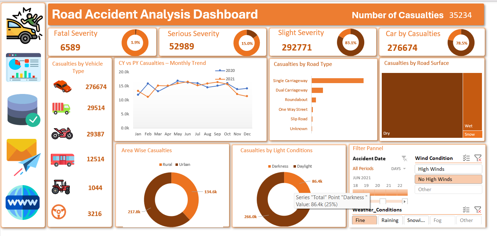

# Road Accident Analysis Dashboard

An interactive Excel dashboard to analyze road accident data and extract actionable insights.

---
## Project Overview
This project analyzes road accident data using an interactive Excel dashboard.  
It helps identify accident trends, high-risk conditions, and key safety insights.

## Tools & Technologies
- Microsoft Excel  
- Pivot Tables  
- Charts & Data Visualization  

## Dataset Description
The dataset contains information about:
- Accident severity (Fatal, Serious, Slight)
- Vehicle type involved
- Road type & surface conditions
- Light & weather conditions
- Monthly accident trends

## Dashboard Preview

## Key Insights
- Maximum accidents fall under Slight Severity (83%)
- Cars are involved in the majority of accidents  
- Most accidents occur in urban areas  
- Higher accidents during daylight conditions  
- Dry roads contribute to the highest accident cases  
- Peak accident trend observed during mid-year months  

## Features
- KPI Cards (Total casualties, severity breakdown)  
- Monthly trend analysis (CY vs PY)  
- Filters for date, weather, and wind conditions  
- Interactive visuals for deeper insights  

## Conclusion
This dashboard helps in understanding accident patterns and can assist in improving road safety measures.
